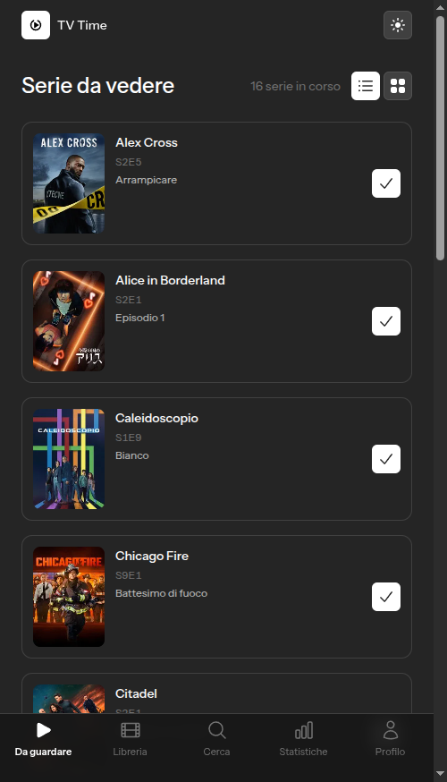
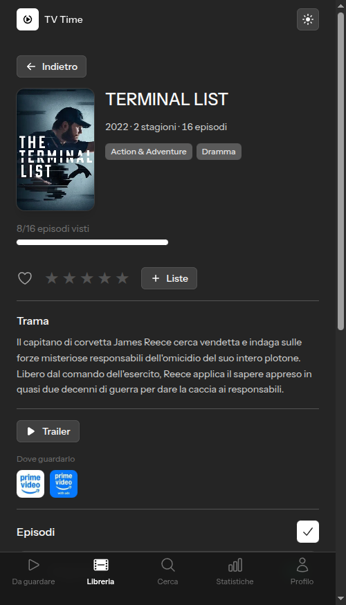
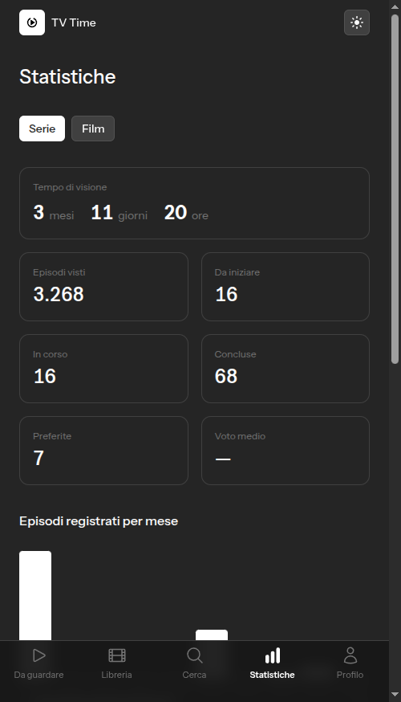

# TvTimeTracker


App personale in stile [TV Time](https://www.tvtime.com/) per tenere traccia di serie viste, episodi in sospeso e film, con statistiche. Gira come app **Android on-device** (nessun server): PHP e il database SQLite viaggiano dentro l'app tramite [NativePHP](https://nativephp.com/).

Progetto single-user pensato per uso proprio. Nasce perché **TV Time ha chiuso il 15 luglio 2026** cancellando i dati degli utenti: questo strumento li importa e permette di continuare a tracciare la propria libreria. Ogni utente usa il proprio token TMDB personale.

## Screenshot

| Serie da vedere | Scheda serie | Statistiche |
|---|---|---|
|  |  |  |

## Installazione (Android)

L'APK firmato è allegato alle [release](https://github.com/NikoAuso/tv-time-tracker/releases). Non è sul Play Store, quindi va installato a mano:

1. Scarica il file `.apk` dall'ultima release direttamente dal telefono.
2. Apri il file: Android chiede di autorizzare l'installazione da fonti sconosciute per l'app che stai usando (browser o gestore file). Concedi il permesso e torna indietro.
3. Al primo avvio inserisci il tuo **token TMDB** (vedi sotto). Senza token l'app non è utilizzabile.
4. Se hai un backup JSON di un'installazione precedente, importalo da **Profilo → Importa / Esporta dati**.

L'APK è firmato con un keystore personale, quindi Play Protect può mostrare un avviso al primo avvio. Per aggiornare a una release successiva, vedi [Aggiornare l'app](#aggiornare-lapp-senza-perdere-i-dati).

## Stack

- **Laravel 13** (PHP 8.4+)
- **Livewire 4** + **Flux** per la UI
- **SQLite** come unico database
- **NativePHP Mobile** per il packaging Android
- **Tailwind CSS** + **Vite**
- Metadati serie/film/episodi da [TMDB](https://www.themoviedb.org/) (token per-utente)

## Funzionalità

- **Serie da vedere**: primo episodio non visto per ogni serie seguita; viste lista, griglia o **calendario** (episodi in arrivo delle serie seguite, raggruppati per data)
- **Libreria** unificata di serie e film con ricerca e filtri; le serie sono raggruppate in *Da iniziare / In corso / Concluse*
- **Ricerca** su tutto il catalogo TMDB (serie e film), in vista lista o griglia
- Segna visto per **episodio**, per **stagione**, "fino a qui" o l'intera serie
- **Voti a stelle** e **preferiti** per serie, film ed episodi
- **Liste** personalizzate per organizzare serie e film
- **Scheda episodio** con link alla serie, valutazione e "dove vederlo"
- Provider **streaming** ("dove vederlo") e **trailer** su serie e film
- **Statistiche**: episodi/film visti, ore totali, andamento per mese, serie più viste, film per decennio, ripartizione per genere
- **Import da TV Time** in due formati (export GDPR e estensione), **backup** JSON export/import
- **Tema** chiaro/scuro
- Blocco locale opzionale con **PIN** (con throttle anti brute-force)

## Limitazioni

- **Single-user**: un solo profilo per installazione, senza login né sincronizzazione tra dispositivi. Il trasferimento tra telefoni si fa con l'export JSON.
- **Solo Android**: NativePHP genera anche uno scheletro iOS, ma non è supportato né testato.
- **Serve un token TMDB personale**: senza, l'app non mostra nulla. I metadati dipendono interamente da TMDB.
- Nessun server: niente backup remoto automatico, notifiche push o job in background. I backup sono manuali.

## Setup (sviluppo)

Prerequisiti: **PHP 8.4+**, **Composer**, **Node** con npm (Vite 8), `sqlite3` da riga di comando. Per i build Android servono anche un **JDK** e l'**Android SDK** (percorsi configurabili via `NATIVEPHP_GRADLE_PATH` e `NATIVEPHP_ANDROID_SDK_LOCATION`).

```bash
composer setup       # install, .env, key:generate, migrate, npm install e build
composer dev         # ambiente di sviluppo completo (`php artisan dev`)
```

In alternativa, i due processi separati:

```bash
npm run dev          # asset in watch
php artisan serve    # http://localhost:8000
```

In sviluppo l'app gira nel browser, non on-device.

Al primo avvio l'app crea e autentica in automatico l'unico utente locale (vedi `AutoLoginSingleUser`), quindi ti porta a inserire il **token TMDB** (vedi sotto). Il PIN è opzionale e si imposta dalle impostazioni.

> Chi clona il repo parte con un'app **vuota**: il `database/seed.sqlite` con i dati personali non è versionato. Inserisci il tuo token TMDB e importa i tuoi dati.

## Token TMDB (obbligatorio, per-utente)

I metadati (poster, trame, episodi) arrivano da TMDB e ogni utente usa il **proprio** token, che si inserisce dall'app in **Profilo → Token TMDB**, dove c'è una guida passo-passo. Senza token l'app non è utilizzabile e reindirizza alla schermata di inserimento.

Il token è salvato cifrato nel database locale (`users.tmdb_token`), non è mai condiviso né imbarcato nei build (`TMDB_TOKEN` è escluso via `cleanup_env_keys`). In sviluppo puoi opzionalmente valorizzare `TMDB_TOKEN` nel `.env` per comodità, ma non è il meccanismo usato dall'app.

## Importare i propri dati da TV Time

> **TV Time ha chiuso il 15 luglio 2026.** Entrambi i canali di export qui sotto non sono più utilizzabili per generare un nuovo file: il servizio GDPR è offline e l'estensione richiede una sessione TV Time attiva. Questa sezione resta valida **solo se hai già scaricato il tuo export** prima della chiusura.

Si importa da **Profilo → Importa / Esporta dati**, in due formati (entrambi idempotenti: reimportare non duplica, i campi mancanti si completano). Convergono sullo stesso record TMDB, quindi puoi usarli anche insieme.

| Formato | Origine | Note |
|---|---|---|
| **Export GDPR** (CSV) | `gdpr.tvtime.com` — servizio dismesso | Ufficiale e completo (watchlist, liste, voti). Film matchati per titolo+anno. |
| **Estensione «TV Time Out»** (JSON) | [Chrome Web Store](https://chromewebstore.google.com/detail/tv-time-out-by-refract/pmejpdpjbkjklfceogdkolmgclldogbi) — l'estensione esiste ancora ma non ha più un servizio da cui esportare | Fornisce gli **id imdb/tvdb** → match TMDB esatto. Più affidabile per i visti. |

Import da CLI (sviluppo):

```bash
# export GDPR (cartella con i CSV)
php artisan import:tvtime /percorso/export --user=1
# export estensione (cartella con i JSON)
php artisan import:tvtime-json /percorso/export --user=1

php artisan shows:sync     # collega le serie a TMDB e scarica gli episodi
php artisan movies:sync    # collega i film a TMDB
```

I comandi `*:sync` usano il token TMDB dell'utente.

## Build Android on-device

Per un build personale il proprio DB viene imbarcato come `database/seed.sqlite` e copiato nel DB dell'app al primo avvio (vedi `BundleSeeder`). Per rigenerarlo dopo modifiche a dati o schema:

```bash
cp database/database.sqlite database/seed.sqlite
# il token TMDB è cifrato con l'APP_KEY: NON imbarcarlo nel seed, altrimenti
# on-device dà "The MAC is invalid". Lo reinserisci in-app al primo avvio.
sqlite3 database/seed.sqlite "UPDATE users SET tmdb_token = NULL;"
```

Build ed esecuzione tramite i comandi `native:*` di NativePHP:

```bash
php artisan native:run android          # debug su emulatore/device
php artisan native:credentials          # genera il keystore per la firma
php artisan native:build --release       # APK firmato
```

I build di release non imbarcano `TMDB_TOKEN` (escluso via `cleanup_env_keys`): ogni utente inserisce il proprio.

## Aggiornare l'app senza perdere i dati

Il seed imbarcato viene caricato **una volta sola**, alla prima migration su device: se il database contiene già un utente, viene ignorato (vedi `seed_library_from_bundle`). Da qui le due strade:

| Operazione | Cosa succede ai dati |
|---|---|
| **Installare l'APK sopra** quello esistente | I dati restano. Le nuove migration girano al primo avvio, il seed non viene ricaricato. |
| **Disinstallare e reinstallare** | Android cancella lo storage dell'app: si riparte dal seed imbarcato nell'APK, quindi **i progressi successivi al build si perdono**. |

L'aggiornamento in place funziona solo se l'APK è firmato con lo **stesso keystore** e ha lo stesso `NATIVEPHP_APP_ID` della versione installata; altrimenti Android la tratta come un'app diversa e la installa a fianco.

Prima di disinstallare, esporta sempre il backup da **Profilo → Importa / Esporta dati** e reimportalo dopo l'installazione.

## Test

```bash
composer test        # pint (check), phpstan e suite Pest
php artisan test     # solo la suite
```

Il progetto usa **Pest**. Altri script utili: `composer lint` (pint in scrittura), `composer types:check` (solo phpstan).

## Licenza

[MIT](LICENSE)
